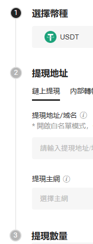

幫我寫step組件,最後實現需要是

```tsx
<Step current={2}>
  <Step.Item title="選擇幣種">
    <div>step1</div>
  </Step.Item>
  <Step.Item title="提現地址">
    <div>step2</div>
  </Step.Item>
  <Step.Item title="提現數量">
    <div>step3</div>
  </Step.Item>
</Step>
```

左邊會有一個目前進度的進度條,中間會有一條線隨著Step.Item的高度



使用tailwindcss來製作
